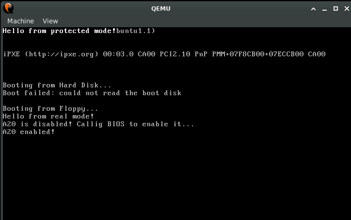

# Playing with Bootloaders

It's been a while since I've coded in assembler, so I figured I'd play with bootloaders to brush up my assembler knowledge and also do something fun along the way.

## Helloworld

Simple bootloader to get things started.

```bash
$ ./run.sh helloworld
```

```
Booting from Hard Disk...
Boot failed: could not read the boot disk

Booting from Floppy...
Hello World!
```

## Print HEX

Now the bootloader prints HEX numbers, fancy!

```bash
$ ./run.sh print_hex_addresses
```

```
Booting from Hard Disk...
Boot failed: could not read the boot disk

Booting from Floppy...
0x1fa5
```

## Reading from disk

This example reads sectors from disk to memory. The example writes 512 bytes of bootloader code and then appends 2 blobs of 512 bytes: one with `0xdead` word repeated all over and the other with `0xbeef` repeated all over.

The code tries to load 5 sectors and read the first word of the first 2 sectors (the other 3 sectors have garbage, which _should_ be all zeros), this is done to prove we actually read the disk and moved it to memory.

```bash
$ ./run.sh read_disk
```

```
Booting from Floppy...
Loaded 5 sectors to memory.
Word at 0x9000: 0xdead
Word at 0x9200: 0xbeef
```

A variation of this example shows how errors are handled. If we modfy line 18 of `bootloader.asm` to read more sectors, we'll find there's a hard limit reading more than 56 sectors (0x38). The explanation is that we're out of 16 bit addresses to address those extra sectors.

In 16 bit real mode we can address memory up to 0xffff = 64 KiB. We're loading at 0x9000, that means we only get 0x10000 - 0x9000 = 0x7000, or 28 KiB. 28KiB / 512 = 56 sectors left that we can load. Attempting to read 56 sectors will succeed (it'll say that it read 5 sectors, but that number is a hardcoded char), attempting to read 57 sectors will fail with a disk error message.

```
Booting from Floppy...
Disk read error!
```

But we could read that much segments if we move to the following segment. ES is 0 in the previous example, but we can change it to 1 and load 57 sectors of disk to memory at address 1:0x0000 (ES:BX). We can even load 128 sectors! But not 129, that'll cause a disk error, because we're at the end of the segment (64 KiB).

## Switch to Protected Mode

This example switches from 16 bit Real Mode to 32 bit Protected mode. The code has a lot of comments on each step I take, explaining everything that happens in the middle.

```bash
$ ./run.sh switch_to_pm
```



In the example I focus on A20 a lot, not because it's required to do all the things I did here to switch to PM (bootloaders use BIOS functionality to check rather than the memory loop thing I did here) but because it's an interesting problem to look at. I created an assembler routine [check_a20.asm](src/common/check_a20.asm) to do a manual check by checking if two bytes coincide on different addresses (one that looped over the memory). This is educational only, if you need to check if A20 is enabled just use the BIOS (`ax = 2402h` and `int 15h`).